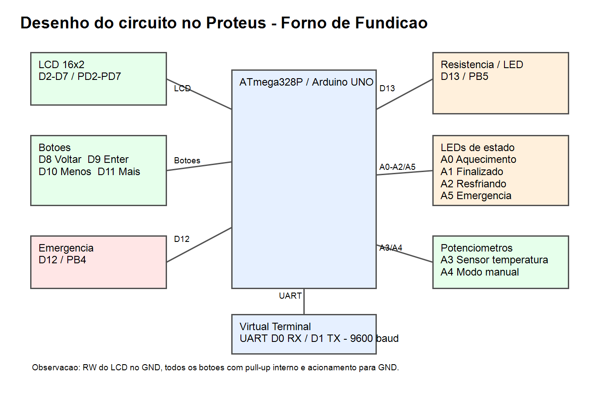

# Forno de Fundição Programável com ATmega328P

Projeto didático de um forno de fundição programável utilizando ATmega328P, LCD 16x2, botões físicos, UART, ADC, Timer1, máquina de estados, LEDs de sinalização, emergência e controle de aquecimento com soft starter.

## Objetivo

O objetivo do projeto é simular o controle de um forno de fundição em ambiente didático. O sistema permite selecionar perfis de material, configurar tempo de patamar, ler temperatura por ADC, usar modo manual por potenciômetro, acompanhar o estado pelo LCD/UART e interromper o processo por emergência física.

## Funcionalidades

- Seleção de perfil
- Alumínio
- Latão
- Personalizado
- Modo manual
- LCD 16x2
- Botões físicos
- UART
- ADC
- Timer1
- Máquina de estados
- Soft starter
- Resfriamento natural
- Emergência
- LEDs de sinalização
- Simulação no Proteus

## Perfis disponíveis

| Perfil | Temperatura alvo | Funcionamento |
|---|---:|---|
| Alumínio | 660°C | Automático |
| Latão | 930°C | Automático |
| Personalizado | Ajustável de 50 em 50°C | Automático |
| Modo manual | Potenciômetro A4 | Controle proporcional |

## Funcionamento geral

1. Sistema inicia.
2. Usuário seleciona perfil.
3. Se for Alumínio ou Latão, usa temperatura pré-configurada.
4. Se for Personalizado, usuário ajusta temperatura alvo.
5. Usuário ajusta tempo de patamar.
6. Sistema confirma início.
7. Executa pré-aquecimento.
8. Executa aquecimento.
9. Entra em patamar.
10. Entra em resfriamento natural.
11. Finaliza.
12. Emergência pode interromper o processo.

## Modo manual

O modo manual usa um potenciômetro no pino A4. Esse potenciômetro controla proporcionalmente a resistência em D13. O sensor em A3 continua sendo lido durante o modo manual, e a temperatura exibida é o valor do sensor multiplicado por 10.

Ao apertar ENTER no modo manual, o sistema desliga a resistência e entra no resfriamento. No estado de resfriamento, ENTER volta ao início.

## Sensor de temperatura

O sensor de temperatura fica no pino A3, usando ADC3. O ADC lê valores de 0 a 1023. A conversão física usada no código é de 0°C a 110°C.

A temperatura simulada do processo é:

```text
Temperatura do processo = temperatura do sensor x 10
```

Exemplo:

```text
Sensor = 66°C
Temperatura simulada = 660°C
```

## Soft starter

A resistência em D13 não liga diretamente em nível alto contínuo. O código usa um soft starter por software, aumentando gradualmente o acionamento em pulsos com base no Timer1.

## Máquina de estados


Estados usados no firmware:

- INICIO
- CONFIGURACAO
- CONFIRMAR_INICIO
- PRE_AQUECIMENTO
- AQUECIMENTO
- PATAMAR
- RESFRIAMENTO
- FINALIZADO
- MODO_MANUAL
- ERRO

## Pinagem

| Função | Arduino | ATmega328P |
|---|---|---|
| LCD RS | D2 | PD2 |
| LCD E | D3 | PD3 |
| LCD D4 | D4 | PD4 |
| LCD D5 | D5 | PD5 |
| LCD D6 | D6 | PD6 |
| LCD D7 | D7 | PD7 |
| Voltar | D8 | PB0 |
| Enter | D9 | PB1 |
| Menos | D10 | PB2 |
| Mais | D11 | PB3 |
| Emergência | D12 | PB4 |
| Resistência | D13 | PB5 |
| LED Aquecimento | A0 | PC0 |
| LED Finalizado | A1 | PC1 |
| LED Resfriando | A2 | PC2 |
| Sensor temperatura | A3 | ADC3 / PC3 |
| Potenciômetro manual | A4 | ADC4 / PC4 |
| LED Emergência | A5 | PC5 |

## LEDs

| LED | Pino | Função |
|---|---|---|
| Aquecimento | A0 | Acende quando a resistência está ativa |
| Finalizado | A1 | Acende quando o processo termina |
| Resfriando | A2 | Acende no resfriamento |
| Emergência | A5 | Pisca em emergência |

## Botões

| Botão | Pino | Função |
|---|---|---|
| Voltar | D8 | Voltar/cancelar |
| Enter | D9 | Confirmar |
| Menos | D10 | Diminuir |
| Mais | D11 | Aumentar |
| Emergência | D12 | Parar o sistema |

## UART

A UART usa 9600 baud, 8 bits, sem paridade e 1 stop bit. Para usar o Virtual Terminal no Proteus:

- TX do Arduino D1 / PD1 -> RXD do Virtual Terminal
- RX do Arduino D0 / PD0 -> TXD do Virtual Terminal
- GND comum

| Comando | Função |
|---|---|
| U | Mais |
| D | Menos |
| E | Enter |
| B | Voltar |
| S | Status |
| X | Emergência |

Exemplo de saída atual:

```text
STATUS Modo=AQUECENDO Temp=660°C Alvo=660°C
```

## Simulação no Proteus



O projeto foi preparado para simulação no Proteus usando ATmega328P/Arduino UNO, LCD 16x2, botões, LEDs, potenciômetros, terminal virtual e circuito de acionamento da resistência.

O print do circuito ainda deve ser colocado em:

```text
images/circuito-proteus.png
docs/circuito-proteus.png
```

## Como compilar

1. Abra o Microchip Studio / Atmel Studio.
2. Crie ou abra um projeto para ATmega328P.
3. Adicione em Source Files:
   - `firmware/main.c`
   - `firmware/LCDlibrary.c`
4. Adicione em Header Files:
   - `firmware/PRINCIPALS.h`
   - `firmware/LCDPRINCIPALS.h`
   - `firmware/FORNO_CONFIG.h`
5. Compile o projeto.
6. Carregue o `.hex` no Proteus.

Também existe o script `build.ps1` para compilar com `avr-gcc`, caso o toolchain esteja instalado.

## Como testar

1. Abrir a simulação no Proteus.
2. Iniciar o circuito.
3. Ver LCD inicial.
4. Selecionar perfil.
5. Ajustar tempo de patamar.
6. Confirmar início.
7. Observar aquecimento.
8. Ver status na UART.
9. Testar modo manual com A4.
10. Testar emergência em D12.
11. Ver LEDs.

## Autores

- Nome 1
- Nome 2
