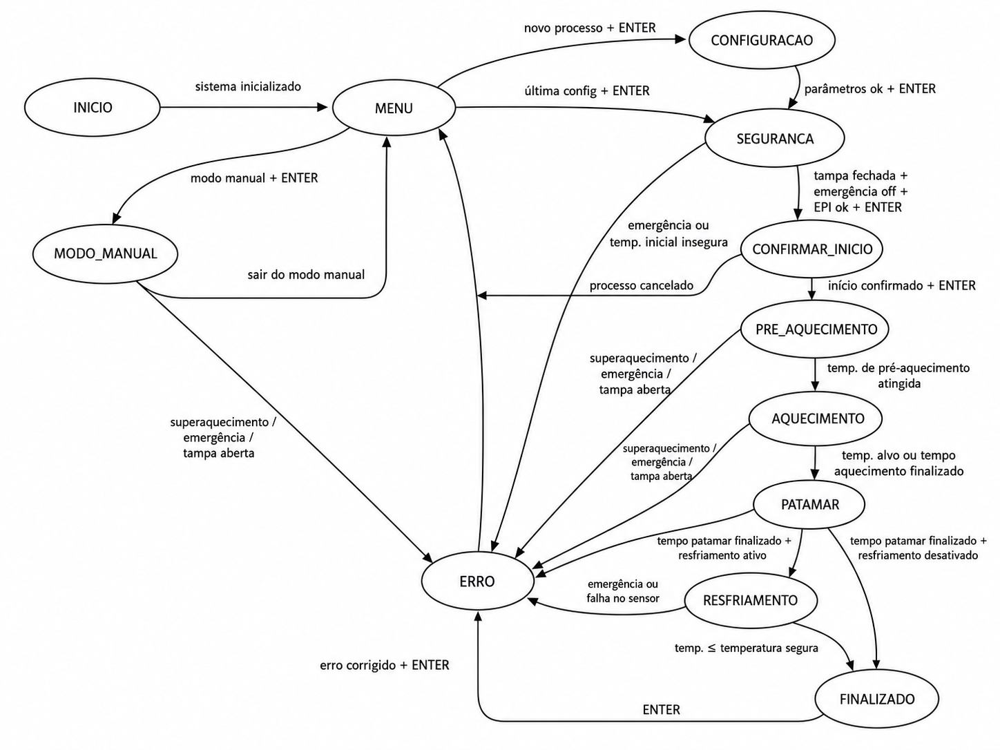

# Relatório - Forno de Fundição Programável com ATmega328P

## 1. Identificação do projeto

Projeto: Forno de Fundição Programável com ATmega328P  
Plataforma: ATmega328P / Arduino UNO em simulação Proteus  
Linguagem: C para AVR, usando registradores

## 2. Objetivo

Desenvolver um sistema embarcado didático para controlar um forno de fundição programável. O projeto simula seleção de perfis, leitura de temperatura, aquecimento, patamar, resfriamento natural, emergência, LEDs, LCD e UART.

## 3. Integrantes

- Nome 1
- Nome 2

## 4. Funcionamento

O sistema inicia exibindo uma mensagem de boas-vindas no LCD. Em seguida, permite selecionar o perfil do processo: Alumínio, Latão, Personalizado ou Modo manual.

Nos perfis automáticos, o sistema usa a temperatura alvo pré-configurada. No perfil personalizado, o usuário ajusta a temperatura alvo de 50 em 50°C. O tempo de patamar é configurado pelo usuário e o tempo de aquecimento é fixo.

Durante o processo, o Timer1 controla a contagem de tempo, o ADC lê o sensor de temperatura em A3, e o controle da resistência usa soft starter por software.

## 5. Máquina de estados



Estados principais:

- INICIO
- CONFIGURACAO
- CONFIRMAR_INICIO
- PRE_AQUECIMENTO
- AQUECIMENTO
- PATAMAR
- RESFRIAMENTO
- FINALIZADO
- MODO_MANUAL
- ERRO

## 6. Pinagem

| Função | Arduino | ATmega328P |
|---|---|---|
| LCD RS | D2 | PD2 |
| LCD E | D3 | PD3 |
| LCD D4 | D4 | PD4 |
| LCD D5 | D5 | PD5 |
| LCD D6 | D6 | PD6 |
| LCD D7 | D7 | PD7 |
| Voltar | D8 | PB0 |
| Enter | D9 | PB1 |
| Menos | D10 | PB2 |
| Mais | D11 | PB3 |
| Emergência | D12 | PB4 |
| Resistência | D13 | PB5 |
| LED Aquecimento | A0 | PC0 |
| LED Finalizado | A1 | PC1 |
| LED Resfriando | A2 | PC2 |
| Sensor temperatura | A3 | ADC3 / PC3 |
| Potenciômetro manual | A4 | ADC4 / PC4 |
| LED Emergência | A5 | PC5 |

## 7. Circuito no Proteus

O arquivo de simulação está em:

```text
simulation/proteus/forno-fundicao.pdsprj
```

O print do circuito deve ser colocado em:

```text
docs/circuito-proteus.png
images/circuito-proteus.png
```

## 8. Explicação do código

O firmware está na pasta `firmware/`.

- `main.c`: inicialização, loop principal, máquina de estados, UART, ADC, Timer1, botões, LEDs e controle do aquecimento.
- `LCDlibrary.c`: biblioteca do LCD 16x2 em modo 4 bits.
- `PRINCIPALS.h`: frequência, includes e macros de bit.
- `LCDPRINCIPALS.h`: pinagem e protótipos da biblioteca LCD.
- `FORNO_CONFIG.h`: defines, enums, struct e mensagens em PROGMEM.

O sistema não usa Arduino API. A leitura de botões, UART, ADC, Timer1 e acionamentos são feitos por registradores AVR.

## 9. Testes

Checklist de validação:

1. LCD mostra a tela inicial.
2. Botões D8 a D11 navegam corretamente.
3. A seleção de perfil funciona.
4. O perfil personalizado altera temperatura de 50 em 50°C.
5. O tempo de patamar aparece no LCD e conta em segundos.
6. O sensor A3 altera a temperatura exibida.
7. A resistência em D13 aciona com soft starter.
8. O modo manual usa potenciômetro em A4.
9. A emergência em D12 trava o sistema em erro.
10. O LED A5 pisca durante emergência.
11. A UART imprime status automaticamente.

## 10. Conclusão

O projeto atende ao objetivo de simular um forno de fundição didático com controle embarcado em ATmega328P. A implementação usa recursos básicos de sistemas embarcados em C AVR, mantendo separação entre firmware, simulação, documentação e página de apresentação.

## 11. Links

- Repositório GitHub: será inserido após publicação.
- GitHub Pages: será inserido após ativação.
